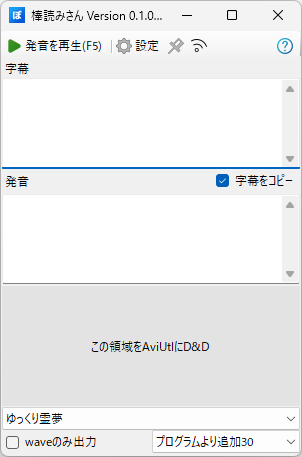
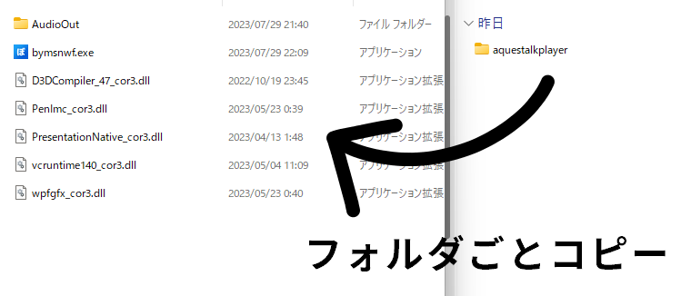
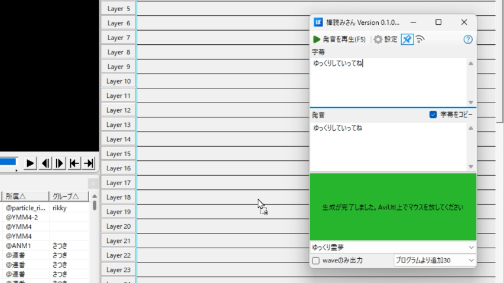
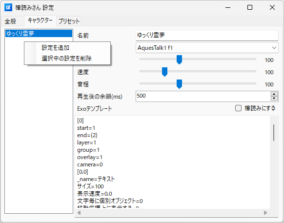
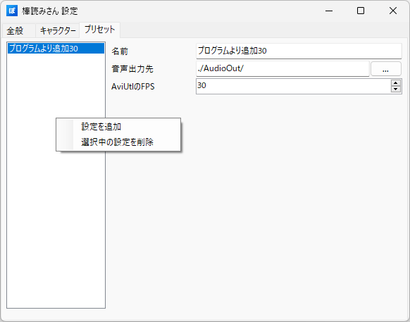

# 棒読みさん WinForms版
棒読みさんはAquesTalkPlayerを使用し、音声と字幕を自動生成する為のツールです。  
[mikado394mさんが開発しているゆくサク](https://github.com/mikado394m/yukkuriutil1)のような機能を持ち、それに加え発音のテストやwaveのみの出力などの追加機能も実装しています。



# 目次
- [導入方法](#導入方法)
    - [1. AquesTalkPlayerのダウンロード](#1-aquestalkplayerのダウンロード)
    - [2. 棒読みさんのダウンロード](#2-棒読みさんのダウンロード)
- [使い方](#使い方)
    - [メイン画面の使い方](#メイン画面の使い方)
    - [ツールバーの使い方](#ツールバーの使い方)
    - [全般設定](#全般設定)
        - [PSDToolKit関連](#psdtoolkit関連)
    - [キャラクター設定の編集 追加 削除](#キャラクター設定の編集-追加-削除)
        - [キャラクター設定の各種項目](#キャラクター設定の各種項目)
    - [プリセットの編集 追加 削除](#プリセットの編集-追加-削除)
        - [プリセットの各種項目](#プリセットの各種項目)
- [注意事項](#注意事項)
- [バグや不具合、質問等](#バグや不具合質問等)
- [使用した言語 ツール ライブラリ等](#使用した言語-ツール-ライブラリ等)

# 導入方法
## 1. AquesTalkPlayerのダウンロード
株式会社アクエストさんのホームページより AquesTalkPlayerをダウンロードし、ダウンロードしたzipファイルを解凍します。  
https://www.a-quest.com/products/aquestalkplayer.html#download

## 2. 棒読みさんのダウンロード
[Releaseページ](https://github.com/unikuma/Bouyomisan.WinForms/releases)から最新版の棒読みさんをダウンロードし、zipファイルを解凍します。  
解凍が終わったら「bymsnwf.exe」があるフォルダに[手順1](#1-aquestalkplayerのダウンロード)で解凍した「aquestalkplayer」フォルダをコピーします。

  
これにて導入は終了になります。

# 使い方
「字幕」テキストボックスに読み上げたいテキストを入力し、「この領域をAviUtlにD&D」と書いている場所を左クリックし続ける事で音声生成及び字幕生成を開始します。  
そのうち色が緑になりメッセージが 「**生成が完了しました。AviUtl上でマウスを放してください**」 と切り替わったら拡張編集にドロップすることで操作が完了します。  


発音を修正する場合は下の「発音」テキストボックスの内容を修正する事により字幕は変えずに音声のみ正しく発音することが出来ます。  


## メイン画面の使い方
- ツールバー  
    [ツールバーの使い方](#ツールバーの使い方)を参照。
- 字幕  
    exoファイルを作成する時に使われます。
- 発音  
    wavファイルを作成する時に使われます。またアクセント記号を設定する事が出来ます。  
    なお選択中のキャラクターで「棒読みにする」が**無効**の場合は**アクセント記号が無視されます。**  
    例: `#>カブ_シキガ'イシャ/アクエ'_スト。`[公式サイトより引用](https://www.a-quest.com/products/aquestalkplayer_man.html#a-index8)
- 字幕をコピー  
    この項目が有効の場合、「字幕」テキストボックスの内容を「発音」テキストボックスにそのままコピーします。  
    デフォルトでこの項目は有効ですが、「発音」テキストボックスが選択されると項目が無効になります。
- 「この領域をAviUtlにD&D」  
    この領域をクリックし続ける事により音声生成及び字幕生成を開始します。  
    この領域が黄色だと音声生成or字幕生成中、緑だとドロップ可能を表します。
- 設定選択用コンボボックス  
    上に配置されているコンボボックスがキャラクター選択用です。  
    右下に配置されているコンボボックスがプリセット選択用です。
- waveのみ出力  
    wavファイルのみを作成しドラッグを開始するための項目です。この項目が有効の場合、exoファイルは生成されません。

## ツールバーの使い方
- 発音の再生  
    「発音」テキストボックスの内容を読み上げます。F5キーを押すことでも再生する事が可能です。
- 設定  
    キャラクターやプリセットの設定を行うウィンドウを表示します。  
    キャラクターの設定方法は[こちら](#キャラクター設定の編集-追加-削除)  
    プリセットの設定方法は[こちら](#プリセットの編集-追加-削除)
- ウィンドウをピン留め  
    ウィンドウを最前面で固定することができます。画像が青色になっていれば機能が有効です。
- 音声出力先表示  
    現在選択中のプリセットの音声出力先をエクスプローラで開きます。設定されている出力先が存在しない場合は新しく作ります。
- ハテナ  
    棒読みさん WinForms版のバージョン情報を表示します。

## 全般設定
### PSDToolKit関連
- exoファイルの代わりにtxtファイルを出力する  
    説明通りで、exoファイルの代わりにtxtファイルを出力します。
    この項目が有効の場合**ドラッグ処理がはいりません**。なので「この領域を...」と書かれている場所をクリックするだけでOKです。押し続ける必要はありません。

## キャラクター設定の編集 追加 削除
設定ウィンドウを開き、キャラクタータブ左側のリストボックスを右クリックすると設定の追加及び削除を行うことができます。  
**※なおメイン画面で選択中の設定を削除する事は出来ません**  


### キャラクター設定の各種項目
- 名前  
    キャラクター設定の名前を入力します。
- 声種  
    キャラクターの声種を選択します。AquesTalk1とAquesTalk2の声種に対応しています。
- 音量・速度・音程  
    言わずもがな。
- 再生後の余韻(ms)  
    音声再生後の余韻を-10000~10000ミリ秒の間で指定します。exoの生成に使う為「waveのみ出力」を有効にした状態では効果ありません。
- 棒読みにする  
    この項目が有効の場合、アクセント記号が無視されアクセントが平板型になります。  
    発音にアクセント記号を入れたのに読み方が変わらない...みたいな時はここを疑ってみると良いかもしれません。
- Exoテンプレート  
    字幕用のexoテンプレートです。[作り方](#Exoテンプレートの作り方)

### Exoテンプレートの作り方
#### 1. AviUtlでテンプレートにしたいオブジェクトをエクスポート  
メモ帳などでエクスポートしたexoファイルを開くとこのようなテキストが出てくると思います。解説では下記のexoを使用します。
```
[exedit]
width=1920
height=1080
rate=60
scale=1
length=211
audio_rate=48000
audio_ch=2
[0]
start=1
end=211
layer=1
group=1
overlay=1
camera=0
[0.0]
_name=テキスト
サイズ=88
表示速度=0.0
文字毎に個別オブジェクト=0
移動座標上に表示する=0
自動スクロール=0
B=0
I=0
type=3
autoadjust=0
soft=1
monospace=0
align=4
spacing_x=5
spacing_y=0
precision=1
color=ffffff
color2=2596ee
font=MS UI Gothic
text=863063304f308a30573066304430633066306d30000000000...(長いので省略)
[0.1]
_name=標準描画
X=0.0
Y=302.0
Z=0.0
拡大率=100.00
透明度=0.0
回転=0.00
blend=0
[1]
start=1
end=211
layer=2
group=1
overlay=1
audio=1
[1.0]
_name=音声ファイル
再生位置=0.00
再生速度=100.0
ループ再生=0
動画ファイルと連携=0
file=
[1.1]
_name=標準再生
音量=100.0
左右=0.0
```
#### 2. exoファイルをメモ帳などで修正  
かなり分かりにくいですが、修正個所としてはこんな感じです。
- [0]より前のテキストが消されている
- endの部分が `end={2}`となっている
- textの部分が `text={0}`となっている
- fileの部分が `file={1}`となっている
```
[0]
start=1
end={2}
layer=1
group=1
overlay=1
camera=0
[0.0]
_name=テキスト
サイズ=88
表示速度=0.0
文字毎に個別オブジェクト=0
移動座標上に表示する=0
自動スクロール=0
B=0
I=0
type=3
autoadjust=0
soft=1
monospace=0
align=4
spacing_x=5
spacing_y=0
precision=1
color=ffffff
color2=2596ee
font=MS UI Gothic
text={0}
[0.1]
_name=標準描画
X=0.0
Y=302.0
Z=0.0
拡大率=100.00
透明度=0.0
回転=0.00
blend=0
[1]
start=1
end={2}
layer=2
group=1
overlay=1
audio=1
[1.0]
_name=音声ファイル
再生位置=0.00
再生速度=100.0
ループ再生=0
動画ファイルと連携=0
file={1}
[1.1]
_name=標準再生
音量=100.0
左右=0.0
```

#### 3. キャラクター設定よりExoテンプレートを上書き  
これにてExoテンプレートの作り方は終了です。

## プリセットの編集 追加 削除
設定ウィンドウを開き、プリセットタブ左側のリストボックスを右クリックすると設定の追加及び削除を行うことができます。  
**※なおメイン画面で選択中の設定を削除する事は出来ません**  


### プリセットの各種項目
- 名前  
    プリセットの名前を入力します。
- 音声出力先  
    wav・exo・txtファイルを保存するフォルダを設定します。
- AviUtlのFPS  
    AviUtlのプロジェクトで設定しているFPS値を設定します。この値が食い違っていると思わぬ挙動が発生する可能性があります。  
    例えば、AviUtlのプロジェクトで設定したFPSが60なのにプリセットで設定したFPSが30だとドロップした字幕や音声が短くなったり...その逆も。

# 注意事項
- 本ソフトはフリーソフトですが、著作権は放棄しておらず「うにくま」が保有しています。
- 無断転載/再配布はご遠慮ください。
- 本ソフトは無保証です。本ソフトの使用から生じるいかなる損害に関して、作者は一切責任を負いません。全て自己責任で使用してください。

# バグや不具合、質問等
バグや不具合、質問、よく分からんところがあれば[作者Twitter](https://twitter.com/unikuma_sub)のリプライやDM、GitHubのIssueによろしくお願いします。

# 使用した言語 ツール ライブラリ等
- C# (.NET6 & WinForms)
- Microsoft Visual Studio Community 2022
- NAudio https://github.com/naudio/NAudio  
    Copyright &copy; 2020 Mark Heath  
    MIT License
- Extension.Serialization  
    Copyright &copy; 2023- unikuma
