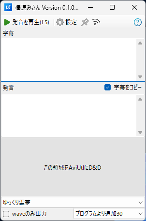
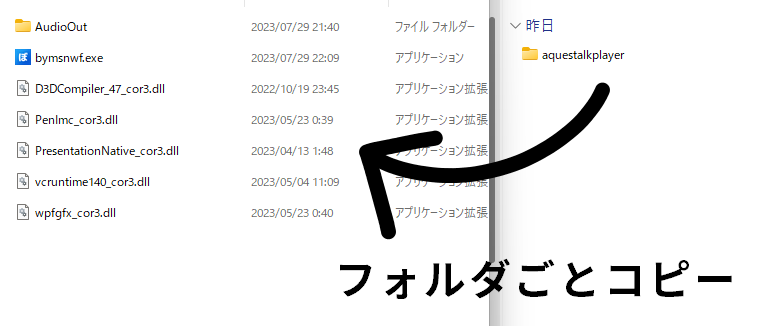

# 棒読みさん WinForms版
棒読みさんはAquesTalkPlayerを使用し、音声と字幕を自動生成する為のツールです。  
[mikado394mさんが開発しているゆくサク](https://github.com/mikado394m/yukkuriutil1)のような機能を持ち、それに加え発音のテストやwaveのみの出力などの追加機能も実装しています。

# 目次
- [導入方法](#導入方法)
    - [1. AquesTalkPlayerのダウンロード](#1-aquestalkplayerのダウンロード)
    - [2. 棒読みさんのダウンロード](#2-棒読みさんのダウンロード)
- [バグ・不具合・質問等](#バグ-不具合-質問等)
- [使用した言語・ツール・ライブラリ等](#使用した言語-ツール-ライブラリ等)

# 導入方法
## 1. AquesTalkPlayerのダウンロード
株式会社アクエストさんのホームページより AquesTalkPlayerをダウンロードし、ダウンロードしたzipファイルを解凍します。  
https://www.a-quest.com/products/aquestalkplayer.html#download

## 2. 棒読みさんのダウンロード
[Releaseページ](https://github.com/unikuma/Bouyomisan.WinForms/releases)から最新版の棒読みさんをダウンロードし、zipファイルを解凍します。  
解凍が終わったら「bymsnwf.exe」があるフォルダに先ほど解凍した「aquestalkplayer」フォルダをコピーします。

これにて導入は終了になります。

# バグ 不具合 質問等
[作者Twitter](https://twitter.com/unikuma_sub)のリプライやDM、GitHubのIssueによろしくお願いします。

# 使用した言語 ツール ライブラリ等
- C# (.NET6 & WinForms)
- Microsoft Visual Studio Community 2022
- NAudio https://github.com/naudio/NAudio  
    Copyright &copy; 2020 Mark Heath  
    MIT License
- Extension.Serialization  
    Copyright &copy; 2023- unikuma
